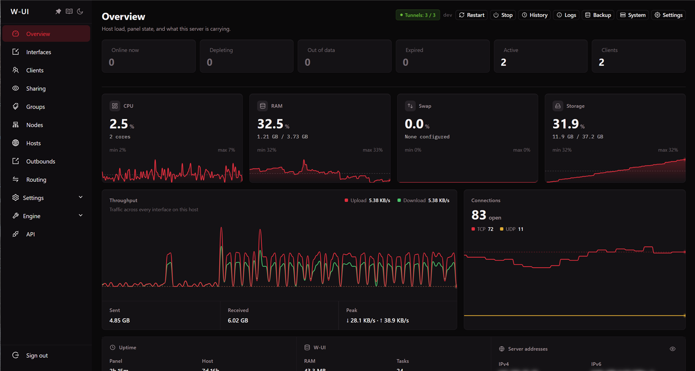
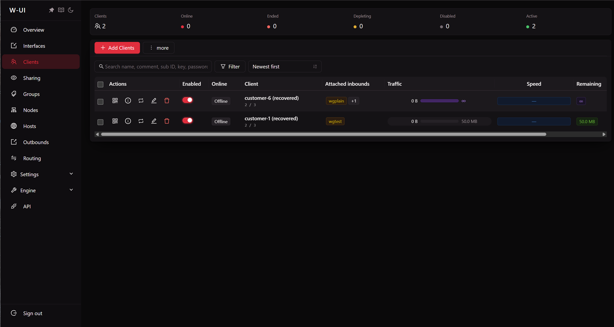
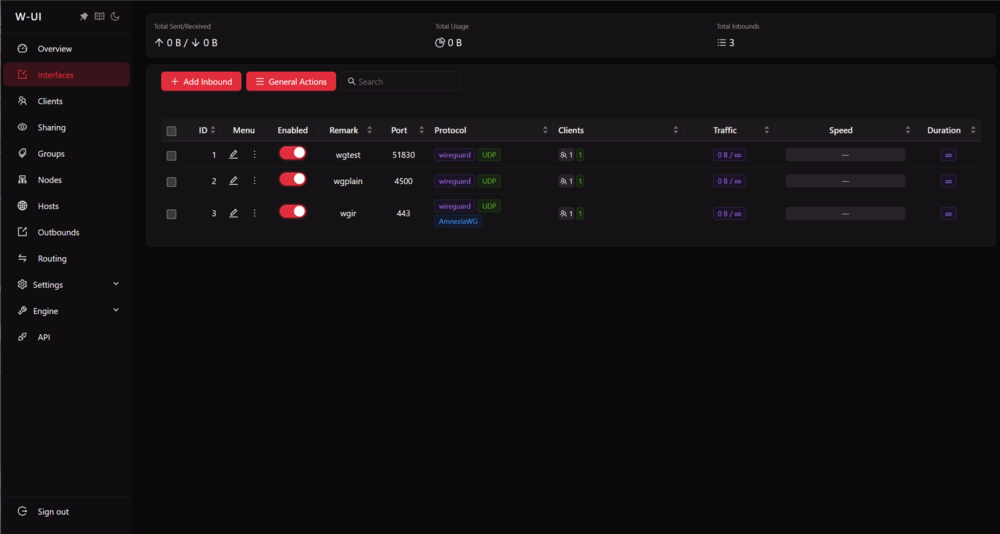

<p align="center"></p>
<h1 align="center">W-UI</h1>

<p align="center">
  A WireGuard, AmneziaWG and OpenVPN panel for selling access — quotas the kernel enforces, expiry, device limits, subscription links, and a management script with the classic panel layout.
</p>

<p align="center">
  <a href="https://github.com/AbolfazlTafakori/w-ui/releases/latest"></a>
  <a href="https://github.com/AbolfazlTafakori/w-ui/actions/workflows/ci.yml"></a>
  <a href="https://abolfazltafakori.github.io/w-ui/"></a>
  <a href="LICENSE"></a>
  
  
</p>

<p align="center">
  <a href="https://abolfazltafakori.github.io/w-ui/">Documentation</a> ·
  <a href="https://abolfazltafakori.github.io/w-ui/fa/">مستندات فارسی</a> ·
  <a href="https://github.com/AbolfazlTafakori/w-ui/releases">Releases</a> ·
  <a href="CHANGELOG.md">Changelog</a> ·
  <a href="SECURITY.md">Security</a>
</p>



<p align="center">
  
  
</p>

---

## Install

One command, on a fresh Ubuntu, Debian, AlmaLinux, Rocky or Fedora server:

```bash
bash <(curl -fsSL https://raw.githubusercontent.com/AbolfazlTafakori/w-ui/main/install.sh)
```

It asks a few questions — port, URL path, administrator, database, certificate — and then runs on its own. Press enter through all of it and nothing about the result is guessable: a random port, a random path, a random administrator name, a generated password, and a Let's Encrypt certificate for the server's own address that renews itself. When it finishes it prints the address, the credentials and an API token, once, and writes the same to `/etc/wui/install-result.env` (root only) for automation to pick up.

```
  ═══════════════════════════════════════════
       Panel Installation Complete!
  ═══════════════════════════════════════════
  Username:    kX4mQ9vTr2
  Password:    ••••••••••••••••
  Port:        41873
  Sub Port:    28114
  WebBasePath: t7GhP3nLqZ8xWc2vRy
  Database:    SQLite (/var/lib/wui/wui.db)
  Access URL:  https://203.0.113.5:41873/t7GhP3nLqZ8xWc2vRy/
  API Token:   wui_…
  ═══════════════════════════════════════════
```

Every question is also a flag, and `-y` skips them all — for cloud-init and CI. Re-running the installer upgrades in place and keeps the port, the path, the database and the administrator. Details, flags and unattended installs: [docs → Install](https://abolfazltafakori.github.io/w-ui/guide/install).

---

## What it does

| | |
|---|---|
| **Tunnels** | WireGuard, AmneziaWG (obfuscated WireGuard) and OpenVPN, several interfaces per server, hosts and host groups that fan one customer out to many addresses |
| **Customers** | data quotas enforced by the kernel, expiry, start-on-first-use, device limits, per-customer speed limits, groups, bulk actions, a Telegram id per plan |
| **Handing out access** | subscription links with 21 page templates, QR codes, config files for every client app, a customer page in the customer's language |
| **Egress** | outbounds with policy routing, balancers with fallback, a fail-closed default outbound, a DNS proxy with pins and per-domain upstreams, geo lists |
| **Operations** | Telegram notifications and an interactive bot, scheduled backups that restore into any version and either database engine, sharing detection, an API with tokens and built-in docs, other servers watched over that same API |
| **Storage** | SQLite for most installs, PostgreSQL for a large customer count — chosen at install, switchable by backup and restore |
| **Install** | one command on five distributions, Let's Encrypt for a domain or for the server's own address renewed unattended, fail2ban wired to the panel's log, a `w-ui` menu with the classic numbering |

### Where the limit is enforced

Most panels poll a byte counter every couple of seconds and disable the customer once it crosses their quota. Between two polls the customer keeps transferring at full speed: on a 100 Mbit link that is about 25 MB of overshoot per poll, on a gigabit link 250 MB. Sell a 1 GB plan and a fast customer quietly gets 1.25 GB.

W-UI programs the limit into the kernel as an `nftables` quota object on the customer's address:

```
quota q_c14 { over 1073741824 bytes used 402653184 bytes }
```

The kernel drops the packet that crosses the ceiling. The panel is not in the data path, so the overshoot is one packet rather than one polling interval, whatever the link speed. The panel still polls — to show usage and to decide when to remove a peer — never to enforce the byte limit.

> This needs the `nft_quota` module. Stock Ubuntu, Debian and most provider kernels have it; minimal, custom and container kernels sometimes do not. The installer checks and says so; without it, limits fall back to polling. The Overview page and `GET /api/system` report which mode is in effect. [How it works](https://abolfazltafakori.github.io/w-ui/reference/how-it-works) has the full picture, speed limits included.

---

## After the install

Open the access URL, sign in, and:

1. **Interfaces** → add one — a WireGuard, AmneziaWG or OpenVPN tunnel on a port of your choosing. The panel generates the keys, brings the interface up and programs the firewall.
2. **Clients** → add a customer — quota in MB, GB or TB, validity in hours, days or months, how many devices, which interfaces.
3. Hand them the subscription link, the QR code or the config file from the client's row.

The rest of the panel — groups, outbounds, balancers, routing, hosts, nodes, the Telegram bot, backups, two-factor authentication — is under Settings and the sidebar, where the classic layout keeps it. [First login](https://abolfazltafakori.github.io/w-ui/guide/first-login) walks through securing it first.

---

## The `w-ui` command

Installing the panel also installs its management script. `w-ui` alone opens the menu — the classic numbering, so anyone who has run a panel of this kind knows this one:

```
│  1. Install          7. Reset Username & Password   12. Start        18. Enable Autostart     20. SSL Certificate Management   26. Enable BBR
│  2. Update           8. Reset Web Base Path         13. Stop         19. Disable Autostart    21. Cloudflare SSL Certificate   27. Update Geo Files
│  3. Update to Dev    9. Reset Settings              14. Restart                               22. IP Limit Management          28. Speedtest by Ookla
│  4. Update Menu     10. Change Port                 15. Restart Tunnels                       23. Firewall Management
│  5. Legacy Version  11. View Current Settings       16. Check Status                          24. SSH Port Forwarding
│  6. Uninstall                                       17. Logs Management                       25. PostgreSQL Management
```

Each entry is also a subcommand: `w-ui start`, `w-ui restart`, `w-ui log`, `w-ui settings`, `w-ui backup`, `w-ui update`, and so on. Anything the script needs from the database it asks the panel binary for, so the schema has one implementation:

```bash
wui setting show                     # what the panel answers on, and the subscription service
wui setting set --port 8443          # move it (applied at the next start)
wui admin reset --username ops       # a new administrator password, printed once
wui token issue --name deploy        # an API token
wui backup create                    # the same archive the panel's scheduler writes
wui backup restore FILE              # staged, applied at the next start; from any version, either engine
```

Reference: [`w-ui`](https://abolfazltafakori.github.io/w-ui/reference/w-ui) · [`wui`](https://abolfazltafakori.github.io/w-ui/reference/wui).

---

## Backups you can trust

An archive holds the database, every interface key and every customer credential — treat it like a password file. Inside it the database is present twice: as a consistent SQLite snapshot, and as a portable JSON dump written through the schema. A restore puts the SQLite file back where the engine matches and loads the dump where it does not, so a backup taken on SQLite restores into a PostgreSQL panel and the other way round, and a backup from an older W-UI restores into a newer one. Scheduled backups go to `/var/backups/wui` with retention; uninstalling keeps a last copy in `/root`. [Backup and restore](https://abolfazltafakori.github.io/w-ui/operations/backup-restore).

---

## API

Everything the panel does is a JSON call under `/api`, documented in the panel itself (Settings → API) and at [docs → API](https://abolfazltafakori.github.io/w-ui/reference/api). Tokens are minted from the API page or with `wui token issue`; a session token works too.

```bash
curl -s -H "Authorization: Bearer $TOKEN" https://panel.example.com:41873/api/clients
```

A **node** is another W-UI panel added by address and token; this one watches its tunnels and customers over the same API, so there is one protocol to secure and a node that misbehaves is still a panel someone can sign in to.

---

## Security

- Passwords are bcrypt hashes. Sign-in is throttled per address and per account, and a wrong name and a wrong password get the same answer in the same time.
- Two-factor authentication (TOTP), asked for only after the password is right, so it never reveals which accounts have one.
- Sessions are HS256 JWTs bound to an HttpOnly cookie: a token that leaves the browser it was issued to does not work on its own. A password change signs out every session.
- A strict Content-Security-Policy, HSTS over TLS, `X-Frame-Options: DENY`, and a random URL prefix under which alone the panel answers.
- The service runs as an unprivileged user with `CAP_NET_ADMIN` and `CAP_NET_BIND_SERVICE` only, `ProtectSystem=strict`, and one writable path.
- Private keys go into the customer's own config file and nowhere the panel renders for display.
- Certificates from Let's Encrypt, renewed unattended; fail2ban jails on the panel's own sign-in log.

Report a vulnerability privately as described in [SECURITY.md](SECURITY.md).

---

## Requirements

Linux with `nftables` and the `nft_quota` module, `wireguard-tools` (`amneziawg` for the obfuscated mode), `openvpn` if you sell it, a public IPv4 address and an open UDP port. The installer brings all of the packages. Tested in CI on Debian 12 and 13, Ubuntu 22.04, 24.04 and 26.04, AlmaLinux 9, Rocky 9 and Fedora 41.

---

## Building from source

```bash
cd web && npm ci && npm run build && cd ..     # the panel, into internal/web/dist
go build -o bin/wui ./cmd/wui                   # one static binary carrying both halves
```

Cross-compile for a server with `GOOS=linux GOARCH=amd64 CGO_ENABLED=0`. During frontend work run `npm run dev` in `web/` and let it proxy the API. `go test ./...` runs the unit tests; `test/` holds integration scripts that need a privileged container and a real kernel — see [Contributing](https://abolfazltafakori.github.io/w-ui/help/contributing).

Releases are built by CI, signed, and published with a `SHA256SUMS`; the installer verifies what it downloads.

---

## License

Copyright © 2026 Abolfazl Tafakori.

W-UI is free software under the [GNU Affero General Public License v3.0](LICENSE). You may use, study, change and redistribute it; if you run a modified version as a service, you must offer its source to your users under the same terms.
